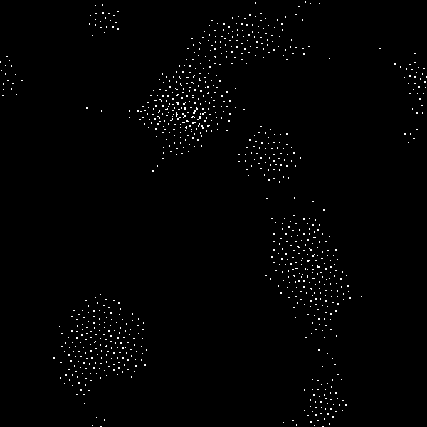
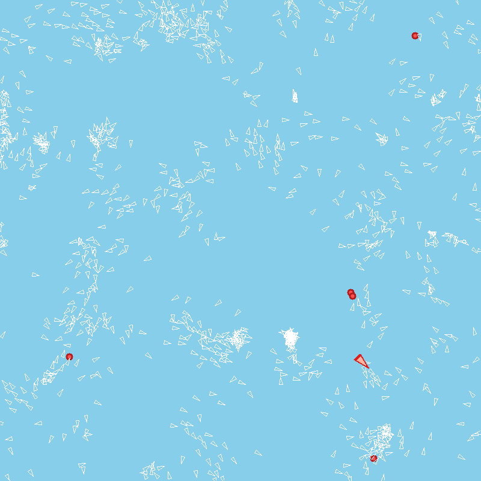

# Boids — simulation de nuées (C / SDL2)

> Version française ci-dessous — English version below.

## Français

Simulation de **boids** (nuées d'oiseaux/poissons) écrite principalement en **C**
avec **SDL2**, basée sur les trois règles classiques de Reynolds :
**cohésion**, **alignement** et **séparation**.

### Aperçu

Simulation lancée avec 1000 boids. À gauche, la version de base (les nuées
s'organisent) ; à droite, la version finale avec un **prédateur** (le triangle
rouge qui chasse les boids, ceux-ci fuient à son approche) et des **bombes** qui
explosent périodiquement.

| Nuées (version de base) | Version prédateur + bombes |
|:---:|:---:|
|  |  |

### Points techniques
- Rendu temps réel avec SDL2 pour un grand nombre de boids (jusqu'à ~1000).
- **Hachage spatial** (découpage de l'espace en cases) pour accélérer la recherche
  des voisins et éviter le coût quadratique.
- Variantes plus avancées : ajout d'un **prédateur** et d'une **« bombe »**
  (`boids_prédateur+bombe.c`).
- Prototypes et expérimentations également en **Python** (`boids.py`, `boids_rebond.py`…).

> **Dossier de travail en l'état.** Ce repo rassemble plusieurs versions
> successives et expérimentations (différents `.c`, scripts Python, archives,
> exécutables), gardées telles quelles. Les fichiers les plus aboutis sont
> `boids_v2.c` et `Projet final/boids_prédateur+bombe.c`.

### Compilation (exemple)
Nécessite **SDL2**.
```bash
gcc boids_v2.c -o boids -lSDL2 -lm
./boids
```
Le code source est regroupé dans le dossier `boids-code/`.

---

## English

A **boids** (bird/fish flocking) simulation written mainly in **C** with **SDL2**,
based on Reynolds' three classic rules: **cohesion**, **alignment** and
**separation**.

### Preview

Simulation running with 1000 boids. On the left, the basic version (the flocks
self-organize); on the right, the final version with a **predator** (the red
triangle hunting the boids, which flee as it approaches) and **bombs** that
explode periodically.

| Flocks (basic version) | Predator + bombs version |
|:---:|:---:|
|  |  |

### Technical highlights
- Real-time SDL2 rendering for a large number of boids (up to ~1000).
- **Spatial hashing** (grid partitioning) to speed up neighbor lookup and avoid
  the quadratic cost.
- More advanced variants: a **predator** and a **"bomb"**
  (`boids_prédateur+bombe.c`).
- Prototypes and experiments in **Python** as well (`boids.py`, `boids_rebond.py`…).

> **Working folder, as-is.** This repo gathers several successive versions and
> experiments (various `.c` files, Python scripts, archives, executables), kept
> as they were. The most polished files are `boids_v2.c` and
> `Projet final/boids_prédateur+bombe.c`.

### Build (example)
Requires **SDL2**.
```bash
gcc boids_v2.c -o boids -lSDL2 -lm
./boids
```
The source code is grouped in the `boids-code/` folder.
